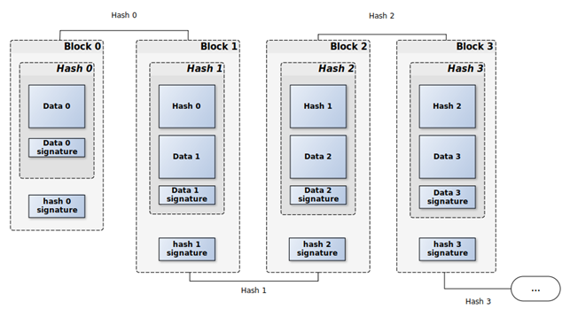

# Blockchain - v.1

## Описание

Этот проект представляет собой простую реализацию блокчейна на Python, использующую базовые принципы криптографии и структуры данных для создания цепочки блоков. Каждый блок включает данные, хеш предыдущего блока и цифровую подпись, обеспечивая неизменность и безопасность цепочки.

Проект состоит из нескольких ключевых частей:
1. **Block**: Класс, представляющий отдельный блок в цепочке.
2. **Blockchain**: Модуль для управления цепочкой блоков.
3. **CryptoUtils**: Утилиты для генерации ключей RSA и создания цифровых подписей.

### Как работает

Процесс работы следующий:
1. Генерируется пара ключей RSA — один для подписания данных, второй для проверки подписей.
2. Создается генезисный блок, который является первым блоком в цепочке.
3. Блоки добавляются в цепочку с сохранением их уникальности и валидации.
4. Каждый блок сохраняет ссылку на предыдущий блок через его хеш, обеспечивая тем самым неизменность данных.
5. Цепочка блоков проверяется на целостность и на отсутствие изменений.

<figure style="text-align: center;">
    
    <figcaption>Схема Блокчейна</figcaption>
</figure>

### Пример блока (JSON):

```json
{
    "index": 1,
    "data": {
        "name": "Jack",
        "city": "New-York"
    },
    "prev_hash": "64d22cc28889796ddb7559d8bfb0b22a54d1b6832e7fa5f6072d0cfad13af039",
    "data_signature": "3c4939c769919a23eb0db599254105422f3db3c1ad4ffe4f71e8c7758c9df2 ...",
    "hash": "b73f17ea3aaae4398c90c6811796ebf9d992475d0a29c38d1f1b43a5b5c84003",
    "hash_signature": "6778e2d01267427d91dbe1d0a0dd4a2302070e70794b12c6f97a796dbda38d ..."
}
```

## Библиотеки

Для реализации проекта были использованы следующие библиотеки:

- **pycryptodome** — для работы с криптографией и RSA-ключами.
- **json** — для сериализации данных в формате JSON и их сохранения/загрузки.
- **typing** — для улучшения читаемости и строгой типизации кода.

### Установка зависимостей

Для того чтобы установить все необходимые библиотеки, используйте файл `requirements.txt`:

```bash
pip install -r requirements.txt
```
