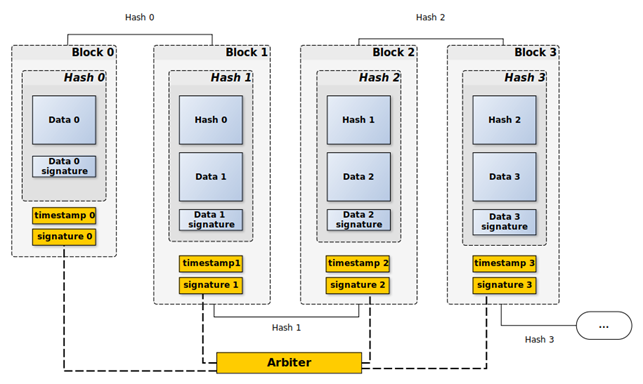

# Blockchain - v.2

## Описание

Версия 2 расширяет функциональность первой версии блокчейна, добавляя взаимодействие с внешним API арбитра для управления цифровыми подписями. В этой версии подписи создаются и проверяются как локально (с использованием RSA-ключей), так и через запросы к API арбитра. Это обеспечивает дополнительный уровень безопасности и гибкости при работе с блокчейном.

### Основные компоненты проекта:
1. **Block**: Класс, представляющий отдельный блок в цепочке.
2. **Blockchain**: Модуль для управления цепочкой блоков.
3. **CryptoUtils**: Утилиты для генерации ключей RSA и работы с цифровыми подписями.
4. **ArbiterAPI**: Новый компонент, который предоставляет методы для взаимодействия с API арбитра, включая запрос подписи и проверку удаленных подписей.

### Как работает

Процесс работы в версии 2 следующий:
1. Генерируется пара ключей RSA для подписи данных и проверки.
2. Создается генезисный блок, который является первым блоком в цепочке.
3. Для каждого нового блока:
   - Хэш блока подписывается локально или запрашивается подпись через API арбитра.
   - Подпись и хэш сохраняются в блоке.
4. Валидация цепочки:
   - Проверяется целостность блоков (хэш каждого блока соответствует хэшу, записанному в следующем блоке).
   - Проверяются локальные подписи или подписи, полученные от арбитра.


<div align="center">
    
    <p>Схема Блокчейна с Арбитром</p>
</div>

### Пример блока (JSON):

```json
{
    "index": 2,
    "data": {
        "name": "Alex",
        "city": "Moscow"
    },
    "prev_hash": "9acab4ebae10c636755c255a0e3384f14eb9d121391bd10ffca464e4395ca222",
    "data_signature": "1b160619a5ec17a24ec67166d910572000c9e2af6e1d7eb4d12cf3c435f0f ...",
    "hash": "34a3251819c9ec6fbd69c75a1c6222cdd4d1c8e67fa74ad99f7b6bb7e052fc74",
    "hash_signature": "8183feb14bc38b12194c8dc28a9cb22ce95e3ee896fae59588fd5adfcd58a ...",
    "timestamp": "2024-12-06T17:24:42.591+03"
}
```

## Библиотеки

Для реализации проекта были использованы следующие библиотеки:

- **pycryptodome** — для работы с криптографией и RSA-ключами.
- **json** — для сериализации данных в формате JSON и их сохранения/загрузки.
- **requests** — для отправки HTTP-запросов к API арбитра.
- **typing** — для улучшения читаемости и строгой типизации кода.

### Установка зависимостей

Для того чтобы установить все необходимые библиотеки, используйте файл `requirements.txt`:

```bash
pip install -r requirements.txt
```
